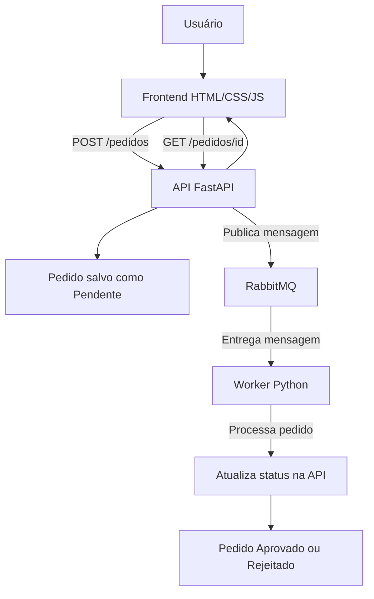

# Ecossistema de Processamento Assíncrono - E-commerce Simplificado

Projeto desenvolvido para a disciplina de **Integração de Software - Unidade 4**.

O objetivo deste projeto é simular o funcionamento de um e-commerce simplificado utilizando integração entre **Frontend**, **API RESTful**, **RabbitMQ** e um **Worker Python** responsável pelo processamento assíncrono dos pedidos.

---

## Objetivo do projeto

A aplicação permite que um usuário crie um pedido por meio de uma interface web simples.

Após o envio, o pedido é recebido pela API em FastAPI, registrado inicialmente com o status **Pendente** e publicado em uma fila RabbitMQ.

Em seguida, um Worker em Python consome essa mensagem da fila, simula o processamento do pedido e atualiza o status final para **Aprovado** ou **Rejeitado**.

---

## Tecnologias utilizadas

* HTML
* CSS
* JavaScript
* Python
* FastAPI
* RabbitMQ
* Docker Compose
* Pytest
* GitHub Actions

---

## Estrutura do projeto

```text
ecommerce-assincrono/
│
├── frontend/
│   ├── index.html
│   ├── style.css
│   └── script.js
│
├── api/
│   ├── main.py
│   ├── database.py
│   ├── requirements.txt
│   └── test_main.py
│
├── worker/
│   ├── worker.py
│   └── requirements.txt
│
├── .github/
│   └── workflows/
│       └── ci.yml
│
├── docker-compose.yml
└── README.md
```

---

## Arquitetura da solução

O fluxo da aplicação funciona da seguinte forma:

```text
Usuário
  ↓
Frontend HTML/CSS/JS
  ↓
API FastAPI
  ↓
RabbitMQ
  ↓
Worker Python
  ↓
API FastAPI atualiza o status
  ↓
Frontend consulta o status atualizado
```

---

## Diagrama de arquitetura



---

## Explicação do fluxo assíncrono

1. O usuário acessa o frontend e preenche os dados do pedido.
2. O frontend envia uma requisição HTTP para a API.
3. A API cria o pedido com status **Pendente**.
4. A API publica uma mensagem na fila RabbitMQ.
5. O Worker Python fica escutando a fila.
6. Quando uma mensagem chega, o Worker inicia o processamento.
7. O Worker simula um tempo de processamento.
8. Ao final, o Worker atualiza o status do pedido para **Aprovado** ou **Rejeitado**.
9. O frontend consulta a API e exibe o status final ao usuário.

---

## Como executar o projeto

### 1. Subir o RabbitMQ

Na raiz do projeto, execute:

```bash
docker compose up -d
```

O painel do RabbitMQ pode ser acessado em:

```text
http://localhost:15672
```

Usuário:

```text
guest
```

Senha:

```text
guest
```

---

### 2. Executar a API

Abra um terminal na pasta da API:

```bash
cd api
```

Instale as dependências:

```bash
python -m pip install -r requirements.txt
```

Execute a API:

```bash
python -m uvicorn main:app --reload
```

A API ficará disponível em:

```text
http://localhost:8000
```

A documentação Swagger ficará disponível em:

```text
http://localhost:8000/docs
```

---

### 3. Executar o Worker

Abra outro terminal na pasta do Worker:

```bash
cd worker
```

Instale as dependências:

```bash
python -m pip install -r requirements.txt
```

Execute o Worker:

```bash
python worker.py
```

O Worker ficará aguardando pedidos na fila RabbitMQ.

---

### 4. Executar o Frontend

Abra o arquivo:

```text
frontend/index.html
```

Também é possível executar com a extensão **Live Server** do VS Code.

---

## Segurança básica

A API possui uma autenticação simples utilizando token Bearer.

Token utilizado no projeto:

```text
meu-token-secreto
```

Exemplo de header necessário nas requisições protegidas:

```text
Authorization: Bearer meu-token-secreto
```

Esse token é utilizado pelo frontend e pelo Worker para acessar os endpoints protegidos da API.

---

## Endpoints principais da API

### GET /

Verifica se a API está funcionando.

Exemplo de resposta:

```json
{
  "mensagem": "API do Ecossistema de Processamento Assíncrono está funcionando."
}
```

---

### POST /pedidos

Cria um novo pedido, registra o status como **Pendente** e publica uma mensagem na fila RabbitMQ.

Exemplo de corpo da requisição:

```json
{
  "cliente": "Felipe",
  "produto": "Mouse Gamer"
}
```

Exemplo de resposta:

```json
{
  "mensagem": "Pedido criado com sucesso e enviado para processamento.",
  "pedido": {
    "id": "id-do-pedido",
    "cliente": "Felipe",
    "produto": "Mouse Gamer",
    "status": "Pendente"
  }
}
```

---

### GET /pedidos/{pedido_id}

Consulta o status atual de um pedido.

Exemplo de resposta:

```json
{
  "id": "id-do-pedido",
  "cliente": "Felipe",
  "produto": "Mouse Gamer",
  "status": "Aprovado"
}
```

---

### PATCH /pedidos/{pedido_id}/status

Atualiza o status de um pedido.

Esse endpoint é utilizado pelo Worker após o processamento da mensagem recebida pela fila.

---

## Testes automatizados

O projeto possui testes automatizados mínimos utilizando Pytest.

Para executar os testes, entre na pasta da API:

```bash
cd api
```

E rode:

```bash
python -m pytest -v
```

Os testes verificam:

* se a rota principal da API responde corretamente;
* se a criação de pedido sem token retorna erro de autenticação.

---

## CI/CD

O projeto possui um workflow simples do GitHub Actions localizado em:

```text
.github/workflows/ci.yml
```

Esse pipeline executa automaticamente os testes da API quando há envio de código para o repositório.

O fluxo do pipeline é:

1. Baixar o código do repositório.
2. Configurar o Python.
3. Instalar as dependências da API.
4. Rodar os testes automatizados.

---

## Demonstração esperada

Durante a execução do sistema, a demonstração deve mostrar:

1. RabbitMQ rodando via Docker.
2. API FastAPI em execução.
3. Worker Python aguardando mensagens.
4. Frontend aberto no navegador.
5. Criação de um novo pedido.
6. Pedido aparecendo inicialmente como **Pendente**.
7. Worker recebendo e processando a mensagem.
8. Status sendo atualizado para **Aprovado** ou **Rejeitado**.
9. Consulta do status final no frontend.
10. Documentação Swagger disponível em `/docs`.

---

## Comandos úteis

Subir RabbitMQ:

```bash
docker compose up -d
```

Verificar containers:

```bash
docker compose ps
```

Executar API:

```bash
cd api
python -m uvicorn main:app --reload
```

Executar Worker:

```bash
cd worker
python worker.py
```

Rodar testes:

```bash
cd api
python -m pytest -v
```

---

## Conclusão

Este projeto demonstra uma solução de integração de software utilizando comunicação RESTful e processamento assíncrono por mensageria.

A separação entre frontend, API, fila RabbitMQ e Worker permite simular um cenário real de e-commerce, em que os pedidos não são processados imediatamente, mas enviados para uma fila e tratados posteriormente por um serviço independente.

Com isso, o projeto atende aos principais pontos da atividade: integração entre sistemas, uso de API RESTful, comunicação assíncrona, segurança básica, testes automatizados, documentação e demonstração funcional.
